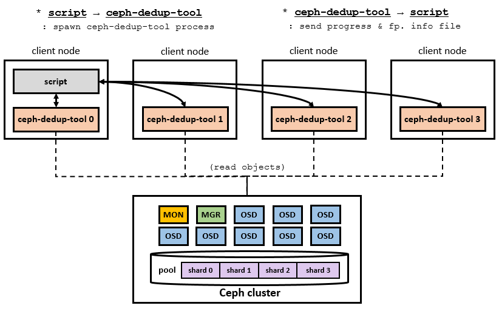
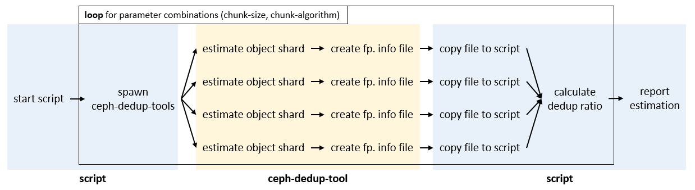

# Estimation tool
This page describes how to estimate the degree of duplication of stored data using *estimation tool*. It does not include deduplication architecture or internal operation. *estimation tool* and this page are written based on **Ceph reef** version.

**Glossary of terms**

* **estimation**: The process of determining the degree of duplication of data stored in a Ceph pool.
* **deduplication (dedup)**: Optimizing storage space by removing duplication of data stored in a pool.
* **dedup ratio**: A degree of dedup that can be achieved
    (dedup ratio = *size of the remaining data after dedup / size of the data before dedup * 100*)

## Introduction

Estimating the dedup ratio of stored data before adopting the dedup feature in the Ceph cluster can help users determine the effectiveness of this feature. Although *ceph-dedup-tool* supports estimating dedup ratio, is has estimating limitations at scale. To resolve this challenge, *estimation tool* can help users estimate the degree of duplication at scale.
In addition, dedup requires a variety of parameters (chunking algorithm, chunk sizes, and so on), and the degree of duplication that can be removed from the same data depends on the setting of these parameter values. Therefore, *estimation tool* tests a variety of parameter combinations and reports the optimal parameter combination that can reduce the size of the stored data the most, helping users to adopt dedup feature.

## Estimation tool

### Components

*estimation tool* is composed of *findbestconfig.py* and *ceph-dedup-tool*.

* **findbestconfig.py**: this scirpt supports multi-processing estimation and finding an optimal parameter set by spawning *ceph-dedup-tool*s in remote nodes. (located in *src/tools/estimation_tool/*)
* **ceph-dedup-tool**: a modified version of *ceph-dedup-tool* (located in *src/tools/*)

### Description

*estimatation tool* is a utility for estimating how much stored data in the pool is duplicated. To overcome the scaling limitation, the automation script spawns multiple *ceph-dedup-tools*, and each *ceph-dedup-tool* shards the objects to be processed so that the estimation can be processed in parallel. *estimation tool* can estimate a pool once it is run. It estimates each pool with various parameter combinations and finally shows a estimation report.

An upstreamed manual of vanilla *ceph-dedup-tool* can be seen at the following link.
> An official *ceph-dedup-tool* documentation
> * ref: https://github.com/ceph/ceph/blob/main/doc/dev/deduplication.rst


#### Estimation tool overview



This figure shows relationships between the components and Ceph cluster.

#### Estimation procedure



This figure shows how *estimation tool* works. Since script starts, from spawning *ceph-dedup-tool*s to calculating dedup ratio is repeated while varying dedup parameter combinations.

* **start script**: user executes *findbestconfig.py* script
* **spawn ceph-dedup-tools**: script spawns ceph-dedup-tools according to user's input
* **estimate object shard**: estimate (read, chunking, and update fp. info) for all object in its own shard
* **create fp. info file**: when estimate is done, ceph-dedup-tool creates file including fp. info (write in /tmp/)
* **copy file to script**: script copy fp. info file from client node into the node script is running
* **calculate dedup ratio**: when all ceph-dedup-tools' fp. info files are aggregated, script calculates dedup ratio
* **report estimation**: finally script reports estimated dedup ratio results


#### Dedup parameter combinations

When the script spawns *ceph-dedup-tool*s chunk-size and chunk-algorithm are passed to each *ceph-dedup-tool*. So the script estimates for every combination, it means estimation will be run (# chunk-sizes * # chunk-algorithms) times.

* **chunk-algorithm**: a method to dividing object into chunks [fixed | fastcdc]
* **chunk-size**: a size of divided chunk [64KB | 32KB | 16KB | 8KB | 4KB]

※ **Note that**, the dedup ratio measured by this tool is an ideal measure of the degree of duplication of the stored data. Therefore, when deduplication is actually performed, the amount of duplication that can be removed may be less than the dedup ratio measured in the estimation. It is recommended to use *estimation tool* to refer to the data duplication trend and an optimal parameter set.

###  Prerequisites

* To estimate dedup ratio by using *estimation tool*, Ceph cluster must be provisioned and running. And, the dataset also need to be stored in the Ceph pool.
* The modified *ceph-dedup-tool* binary is required to use *estimation tool* described in this document. (install in all nodes)
* *paramiko* pip3 package is required in start client node.


### Script options

* **target_pool**: A Ceph pool to be estimated deduip ratio
* **num_worker**: How many *ceph-dedup-tool* process will be used in parallel
* **server**: A server's ip address that a *ceph-dedup-tool* is executed. This input is repeated for the number of *num_worker*.
* **port**:  A port number for accessing the ssh server. This input is repeated for the number of *num_worker*.
* **user**: An user name for accessing the ssh server. This input is repeated for the number of *num_worker*.
* **password**: An user password for accessing the ssh server. This input is repeated for the number of *num_worker*.

### Additional Variables
In the findbestconfig.py script, you can adjust several variables. These variables include the following:

* **CHUNK_ALGORITHM_OPTIONS**: These are test options for the algorithm that splits data into chunks. You can remove items that will not be tested.
* **CHUNK_SIZE_OPTIONS**: These are test options for the size that splits data into chunks. You can add or remove sizes to be tested.
* **RESULT_FILE**: This is the file path where the test results will be recorded.
* **WINDOW_BITS**: This is the window bit parameter to be used in the FastCDC algorithm.
* **FP_ALGO**: This is the hash algorithm used to fingerprint the data. It supports sha1, sha256, sha512.
* **DEDUP_TOOL_MAX_THREAD**: This is the number of threads to be used within one ceph-dedup-tool process.

## Usage
### Example
An example of how to run the script.

```
root@node1# python3 findbestconfig.py
estimate target ceph pool: log_pool
total numbers of worker: 2
server 0 ip: 172.100.3.35
server 0 ssh port: 22
server 0 user: root
server 0 password:
server 1 ip: 172.100.3.36
server 1 ssh port: 22
server 1 user: root
server 1 password:
preflight on 172.100.3.35 passed!
preflight on 172.100.3.36 passed!
```

While the script is running it reports how far the estimation has progressed.

```
estimate with chunk algorithm: fixed, chunk size: 65536
Progress: 26.08% / 100% (read: 1.8 GiB/s, total: 15.8 GiB / 60.59 GiB)
```


### Output

*estimate tool* shows the result as both a format of CLI output and a file output.

#### CLI output

```
estimate with chunk algorithm: fixed, chunk size: 65536  
elapsed time: 39s, Result: 33.2 GiB / 60.59 GiB ( 54.79%)  
  
estimate with chunk algorithm: fixed, chunk size: 32768  
elapsed time: 40s, Result: 33.2 GiB / 60.59 GiB ( 54.78%)
...
```


#### File output

```
root@node1# cat result.txt
estimate target ceph pool: log_pool
chunk_algo chunk_size after_dedup / pool_size (     %) elapsed_time
---------- ---------- -------------------------------- ------------
    fixed      65536     33.2 GiB / 60.59 GiB (54.79%)         38s
    fixed      32768     33.2 GiB / 60.59 GiB (54.78%)         33s
    fixed      16384    33.16 GiB / 60.59 GiB (54.73%)         39s
    fixed       8192    33.06 GiB / 60.59 GiB (54.57%)         45s
    fixed       4096    32.69 GiB / 60.59 GiB (53.95%)         66s
  fastcdc      65536    30.47 GiB / 60.59 GiB (50.29%)         34s
  fastcdc      32768    29.37 GiB / 60.59 GiB (48.47%)         36s
  fastcdc      16384    28.28 GiB / 60.59 GiB (46.67%)         34s
  fastcdc       8192    27.05 GiB / 60.59 GiB (44.64%)         44s
  fastcdc       4096    25.96 GiB / 60.59 GiB (42.85%)         48s
```


## Evaluations

### Environmental setup

Ceph cluster and client nodes are composed of following specification.
3 nodes are used as a Ceph cluster, and 4 nodes are used as client nodes.

**Hardware**
* CPU: AMD EPYC 7543 (2 socket, logical 128 core)
* Memory: 512GB
* Network: 100Gbps Ethernet
* Disk: Samsung PM9A3 4TB NVMe


**Ceph**
* Ceph cluster: Ceph 17.2.6 version
* estimate tools and Ceph client: Ceph Reef version
* 1 MON, 1 MGR, 18 OSDs (18 SSDs)


### Estimation for sample datasets
|     chunk     |            log_pool            |            vm_pool           |
|:-------------:|:------------------------------:|:----------------------------:|
| fixed / 64K   | 33.19 GiB / 60.59 GiB (54.77%) | 4.55 TiB / 4.67 TiB (97.43%) |
| fixed / 32K   | 33.18 GiB / 60.59 GiB (54.76%) | 4.34 TiB / 4.67 TiB (92.93%) |
| fixed / 16K   | 33.16 GiB / 60.59 GiB (54.72%) | 4.06 TiB / 4.67 TiB (86.94%) |
| fixed / 8K    | 33.06 GiB / 60.59 GiB (54.56%) | 3.76 TiB / 4.67 TiB (80.51%) |
| fixed / 4K    | 32.69 GiB / 60.59 GiB (53.95%) | 3.41 TiB / 4.67 TiB (73.02%) |
| fastcdc / 64K | 30.44 GiB / 60.59 GiB (50.24%) | 4.21 TiB / 4.67 TiB (90.15%) |
| fastcdc / 32K | 29.35 GiB / 60.59 GiB (48.44%) | 3.93 TiB / 4.67 TiB (84.15%) |
| fastcdc / 16K | 28.27 GiB / 60.59 GiB (46.66%) | 3.36 TiB / 4.67 TiB (71.95%) |
| fastcdc / 8K  | 27.05 GiB / 60.59 GiB (44.64%) | 2.91 TiB / 4.67 TiB (62.31%) |
| fastcdc / 4K  | 25.96 GiB / 60.59 GiB (42.84%) |  2.6 TiB / 4.67 TiB (55.67%) |

The table above represents the deduplication ratio results for two different pools.
The log_pool stores the dashboard log dataset, while vm_pool stores the vm image dataset. The dashboard log dataset totals 60.59 GiB, and the vm image dataset amounts to 4.67 TiB.
We can translate this table, the last entry, in case of using fastcdc algorithm and 4KB chunk size, log_pool can shrink from 60.59 GiB to 25.96 GiB after deduplication, and vm_pool can shrink from 4.67 TiB to 2.6TiB.
The fastcdc chunk algorithm tends to show a higher degree of data duplication compared to the fixed one. Moreover, as the chunk size decreases, the duplication increases.

In order to accelerate estimates, the number of workers can be increased.
| # of workers | log_pool | vm_pool |
|:------------:|:--------:|:-------:|
|       1      |    151 s |  9660 s |
|       2      |     67 s |       - |
|       4      |     43 s |       - |
|       8      |     30 s |       - |
|      16      |     24 s |  1899 s |

The table above represents the estimation time based on the number of workers.
The log pool is on the left, and the vm pool is on the right in the fastcdc / 4K option.
As the number of workers increases, the time taken for estimates decreases.

